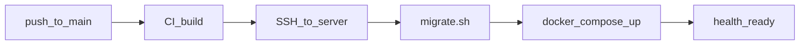

# Деплой Even-APP на сервер

Сервер: **91.218.245.136**  
Стек: Docker Compose (Postgres, MinIO, 5 Go-сервисов).  
CI/CD: GitHub Actions → SSH → `scripts/deploy.sh`.

---

## 1. Первичная настройка сервера (один раз)

Подключитесь по SSH и выполните:

```bash
# Скопировать скрипт на сервер или клонировать репо вручную:
git clone https://github.com/Klimgit/Even-APP.git /opt/even-app
cd /opt/even-app
sudo bash scripts/server-bootstrap.sh   # docker + git, если ещё нет
```

Отредактируйте секреты:

```bash
nano /opt/even-app/.env
```

Шаблон: [deploy/env.production.example](deploy/env.production.example). Обязательно замените:

- `POSTGRES_PASSWORD`
- `JWT_SECRET` (длинная случайная строка)
- `S3_ACCESS_KEY` / `S3_SECRET_KEY`
- `S3_PUBLIC_ENDPOINT` — публичный URL MinIO для presigned media (см. ниже)

Первый деплой вручную:

```bash
cd /opt/even-app
./scripts/deploy.sh
```

Проверка:

```bash
curl http://localhost:8080/api/v1/ready
curl http://91.218.245.136:8080/health
```

### Firewall

Откройте порты:

| Порт | Назначение |
|------|------------|
| 8080 | API Gateway (обязательно) |
| 22   | SSH (для CI/CD) |
| 9000 | MinIO public URLs для медиа (опционально; лучше nginx) |

Пример (ufw):

```bash
sudo ufw allow 22/tcp
sudo ufw allow 8080/tcp
sudo ufw enable
```

---

## 2. GitHub Actions — секреты

В репозитории: **Settings → Secrets and variables → Actions**.

| Secret | Пример | Описание |
|--------|--------|----------|
| `DEPLOY_HOST` | `91.218.245.136` | IP сервера |
| `DEPLOY_USER` | `root` или `deploy` | SSH-пользователь |
| `DEPLOY_SSH_KEY` | содержимое приватного ключа | Ключ **без** passphrase |
| `DEPLOY_PATH` | `/opt/even-app` | Путь к репозиторию на сервере |
| `DEPLOY_PORT` | `22` | (опционально) SSH-порт |

### SSH-ключ для CI

На **локальной машине**:

```bash
ssh-keygen -t ed25519 -f ~/.ssh/even-deploy -N ""
```

- Публичный ключ → `~/.ssh/authorized_keys` на сервере (для `DEPLOY_USER`)
- Приватный ключ → GitHub secret `DEPLOY_SSH_KEY`

```bash
ssh-copy-id -i ~/.ssh/even-deploy.pub DEPLOY_USER@91.218.245.136
```

### Environment (опционально)

Создайте environment **production** в GitHub для approval перед деплоем.

---

## 3. Как работает пайплайн



| Workflow | Триггер | Действие |
|----------|---------|----------|
| [ci.yml](.github/workflows/ci.yml) | PR, push в feature-ветки | `go build` + docker build smoke |
| [deploy.yml](.github/workflows/deploy.yml) | push `main`, manual | CI → SSH → `deploy.sh` (production) |
| [deploy-preview.yml](.github/workflows/deploy-preview.yml) | manual, выбор ветки | CI ветки → SSH → `deploy-preview.sh` |

### Preview (тест отдельных веток)

Отдельный слот на том же сервере — **не трогает production** (`/opt/even-app`).

| | Production | Preview |
|---|------------|---------|
| Путь | `/opt/even-app` | `/opt/even-app-preview` |
| API | `:8080` | `:9080` |
| Postgres | `127.0.0.1:5432` | `127.0.0.1:5433` |
| MinIO | `127.0.0.1:9000` | `127.0.0.1:9010` |
| Compose project | `even-app` | `even-preview` |

**Первичная настройка preview (один раз):**

```bash
ssh DEPLOY_USER@91.218.245.136
sudo bash /opt/even-app/scripts/server-bootstrap-preview.sh
# или после clone:
cd /opt/even-app-preview && cp deploy/env.preview.example .env && nano .env
sudo ufw allow 9080/tcp
```

**Деплой ветки:**

- GitHub: **Actions → Deploy Preview → Run workflow** → указать имя ветки (`feature/foo`)
- На сервере: `cd /opt/even-app-preview && ./scripts/deploy-preview.sh feature/foo`

Одновременно активна **одна** preview-ветка (новый деплой переключает checkout и пересобирает стек).

Опциональный secret: `DEPLOY_PREVIEW_PATH` (по умолчанию `/opt/even-app-preview`).

`deploy.sh`:

1. `COMPOSE_FILE=docker-compose.yml:docker-compose.prod.yml`
2. `./scripts/migrate.sh` — миграции (явный шаг)
3. `docker compose up --build -d`
4. ждёт `/api/v1/ready`

Ручной деплой из GitHub: **Actions → Deploy → Run workflow**.

---

## 4. Production compose

[docker-compose.prod.yml](docker-compose.prod.yml):

- `restart: unless-stopped` на сервисах
- наружу только **8080** (gateway)
- Postgres / MinIO — `127.0.0.1` (доступ с сервера или SSH-туннель)

### MinIO и presigned URL

Клиенты получают `upload_url` / `url` с хостом из `S3_PUBLIC_ENDPOINT`.

Варианты:

1. **Простой:** открыть 9000, `S3_PUBLIC_ENDPOINT=http://91.218.245.136:9000`
2. **Безопаснее:** nginx reverse proxy на `https://media.example.com` → `127.0.0.1:9000`

---

## 5. Обновление и откат

**Авто:** каждый merge в `main` → деплой.

**Вручную на сервере:**

```bash
cd /opt/even-app
git pull origin main
./scripts/deploy.sh
```

**Откат:**

```bash
cd /opt/even-app
git checkout <previous-commit>
./scripts/deploy.sh
```

Миграции БД откатываются отдельно (`just migrate-down` / `migrate down 1` per service).

---

## 6. Логи и отладка

```bash
cd /opt/even-app
export COMPOSE_FILE=docker-compose.yml:docker-compose.prod.yml
docker compose ps
docker compose logs -f api-gateway auth lexicon
docker compose logs auth-migrate   # после migrate
```
