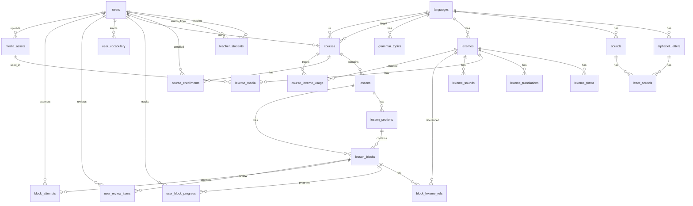

# Even App — модель данных и DTO

---

## ER-диаграмма




---

## Таблицы БД

### users


| Колонка       | Тип                             | Описание                        |
| ------------- | ------------------------------- | ------------------------------- |
| id            | UUID PK                         |                                 |
| email         | TEXT UNIQUE NOT NULL            |                                 |
| password_hash | TEXT NOT NULL                   | bcrypt                          |
| display_name  | TEXT                            |                                 |
| role          | TEXT NOT NULL DEFAULT 'student' | `student` | `teacher` | `admin` |
| created_at    | TIMESTAMPTZ                     | DEFAULT now()                   |


```sql
CHECK (role IN ('student', 'teacher', 'admin'))
```

---

### teacher_students


| Колонка     | Тип             | Описание                |
| ----------- | --------------- | ----------------------- |
| teacher_id  | UUID FK → users | role ∈ {teacher, admin} |
| student_id  | UUID FK → users | role = student          |
| assigned_at | TIMESTAMPTZ     |                         |
| assigned_by | UUID FK → users |                         |


PK: `(teacher_id, student_id)`  
CHECK: `teacher_id != student_id`

---

### languages


| Колонка     | Тип                  | Описание           |
| ----------- | -------------------- | ------------------ |
| id          | UUID PK              |                    |
| code        | TEXT UNIQUE NOT NULL | `evn`, `ru`, `sah` |
| name        | TEXT NOT NULL        | Even               |
| native_name | TEXT NOT NULL        | Эвэды              |
| direction   | TEXT DEFAULT 'ltr'   | `ltr` | `rtl`      |
| is_active   | BOOLEAN DEFAULT true |                    |


---

### alphabet_letters


| Колонка     | Тип                 | Описание               |
| ----------- | ------------------- | ---------------------- |
| id          | UUID PK             |                        |
| language_id | UUID FK → languages |                        |
| character   | TEXT NOT NULL       | `ӈ`                    |
| upper_char  | TEXT                | `Ӈ`                    |
| sort_order  | INT NOT NULL        | порядок на клавиатуре  |
| label       | TEXT                | подсказка произношения |


UNIQUE: `(language_id, character)`

---

### sounds


| Колонка     | Тип                 | Описание      |
| ----------- | ------------------- | ------------- |
| id          | UUID PK             |               |
| language_id | UUID FK → languages |               |
| ipa         | TEXT                | /ŋ/           |
| description | TEXT                |               |
| audio_key   | TEXT                | S3 object key |


---

### letter_sounds


| Колонка   | Тип                        |
| --------- | -------------------------- |
| letter_id | UUID FK → alphabet_letters |
| sound_id  | UUID FK → sounds           |


PK: `(letter_id, sound_id)`

---

### media_assets


| Колонка     | Тип                  | Описание                 |
| ----------- | -------------------- | ------------------------ |
| id          | UUID PK              |                          |
| object_key  | TEXT UNIQUE NOT NULL | `media/{uuid}/file.webp` |
| bucket      | TEXT NOT NULL        |                          |
| mime_type   | TEXT NOT NULL        |                          |
| size_bytes  | BIGINT               |                          |
| width       | INT                  |                          |
| height      | INT                  |                          |
| duration_ms | INT                  |                          |
| uploaded_by | UUID FK → users      |                          |
| created_at  | TIMESTAMPTZ          |                          |


---

### lexemes


| Колонка        | Тип                 | Описание      |
| -------------- | ------------------- | ------------- |
| id             | UUID PK             |               |
| language_id    | UUID FK → languages | scope: язык   |
| lemma          | TEXT NOT NULL       | базовая форма |
| part_of_speech | TEXT                |               |
| notes          | TEXT                |               |
| created_by     | UUID FK → users     |               |
| created_at     | TIMESTAMPTZ         |               |
| updated_at     | TIMESTAMPTZ         |               |


UNIQUE: `(language_id, lemma)`

---

### lexeme_forms


| Колонка   | Тип                                 | Описание           |
| --------- | ----------------------------------- | ------------------ |
| id        | UUID PK                             |                    |
| lexeme_id | UUID FK → lexemes ON DELETE CASCADE |                    |
| form      | TEXT NOT NULL                       | `бишни`            |
| tags      | JSONB                               | `{"person":"3sg"}` |


UNIQUE: `(lexeme_id, form)`

---

### lexeme_translations


| Колонка            | Тип                 | Описание    |
| ------------------ | ------------------- | ----------- |
| id                 | UUID PK             |             |
| source_lexeme_id   | UUID FK → lexemes   |             |
| target_language_id | UUID FK → languages |             |
| text               | TEXT NOT NULL       | перевод     |
| target_lexeme_id   | UUID FK → lexemes   | опционально |


---

### lexeme_media


| Колонка        | Тип                    | Описание      |
| -------------- | ---------------------- | ------------- |
| id             | UUID PK                |               |
| lexeme_id      | UUID FK → lexemes      |               |
| form_id        | UUID FK → lexeme_forms | NULL = лемма  |
| media_asset_id | UUID FK → media_assets |               |
| kind           | TEXT NOT NULL          | см. enum ниже |
| label          | TEXT                   |               |
| is_primary     | BOOLEAN DEFAULT false  |               |
| sort_order     | INT DEFAULT 0          |               |


**lexeme_media.kind:** `image` | `audio_word` | `audio_sentence` | `audio_form` | `video`

---

### lexeme_sounds


| Колонка   | Тип               |
| --------- | ----------------- |
| lexeme_id | UUID FK → lexemes |
| sound_id  | UUID FK → sounds  |


PK: `(lexeme_id, sound_id)`

---

### courses


| Колонка            | Тип                   | Описание            |
| ------------------ | --------------------- | ------------------- |
| id                 | UUID PK               |                     |
| title              | TEXT NOT NULL         |                     |
| target_language_id | UUID FK → languages   | чему учим           |
| ui_language_id     | UUID FK → languages   | язык UI / переводов |
| owner_id           | UUID FK → users       | учитель-владелец    |
| is_published       | BOOLEAN DEFAULT false |                     |


---

### course_enrollments


| Колонка     | Тип                   | Описание                             |
| ----------- | --------------------- | ------------------------------------ |
| user_id     | UUID FK → users       |                                      |
| course_id   | UUID FK → courses     |                                      |
| status      | TEXT DEFAULT 'active' | `active` | `completed` | `suspended` |
| enrolled_at | TIMESTAMPTZ           |                                      |
| enrolled_by | UUID FK → users       |                                      |


PK: `(user_id, course_id)`

---

### lessons


| Колонка      | Тип                  | Описание              |
| ------------ | -------------------- | --------------------- |
| id           | UUID PK              |                       |
| course_id    | UUID FK → courses    |                       |
| title        | TEXT NOT NULL        |                       |
| sort_order   | INT NOT NULL         |                       |
| version      | INT DEFAULT 1        | optimistic locking    |
| status       | TEXT DEFAULT 'draft' | `draft` | `published` |
| locked_by    | UUID FK → users      | v2                    |
| locked_at    | TIMESTAMPTZ          | v2                    |
| published_at | TIMESTAMPTZ          |                       |
| updated_at   | TIMESTAMPTZ          |                       |


---

### lesson_sections


| Колонка      | Тип                                 | Описание                           |
| ------------ | ----------------------------------- | ---------------------------------- |
| id           | UUID PK                             |                                    |
| lesson_id    | UUID FK → lessons ON DELETE CASCADE |                                    |
| title        | TEXT NOT NULL                       |                                    |
| sort_order   | INT NOT NULL                        |                                    |
| section_kind | TEXT DEFAULT 'content'              | `content` | `homework` | `results` |


---

### lesson_blocks


| Колонка       | Тип                                 | Описание       |
| ------------- | ----------------------------------- | -------------- |
| id            | UUID PK                             |                |
| lesson_id     | UUID FK → lessons ON DELETE CASCADE |                |
| section_id    | UUID FK → lesson_sections           | nullable       |
| sort_order    | INT NOT NULL                        |                |
| display_label | TEXT                                | `1.3`          |
| title         | TEXT                                |                |
| block_type    | TEXT NOT NULL                       | enum BlockType |
| config        | JSONB NOT NULL DEFAULT '{}'         | type-specific  |
| is_homework   | BOOLEAN DEFAULT false               |                |


---

### block_lexeme_refs


| Колонка         | Тип                     | Описание                                                        |
| --------------- | ----------------------- | --------------------------------------------------------------- |
| lesson_block_id | UUID FK → lesson_blocks |                                                                 |
| lexeme_id       | UUID FK → lexemes       |                                                                 |
| form_id         | UUID FK → lexeme_forms  |                                                                 |
| role            | TEXT                    | `introduced` | `prompt` | `answer` | `distractor` | `word_bank` |


PK: `(lesson_block_id, lexeme_id, form_id)`

---

### course_lexeme_usage


| Колонка         | Тип                     | Описание                                  |
| --------------- | ----------------------- | ----------------------------------------- |
| id              | UUID PK                 |                                           |
| course_id       | UUID FK → courses       |                                           |
| lexeme_id       | UUID FK → lexemes       |                                           |
| form_id         | UUID FK → lexeme_forms  | nullable                                  |
| lesson_id       | UUID FK → lessons       |                                           |
| lesson_block_id | UUID FK → lesson_blocks |                                           |
| usage_kind      | TEXT NOT NULL           | `introduced` | `exercised` | `referenced` |
| sub_item_index  | INT DEFAULT 0           |                                           |
| created_at      | TIMESTAMPTZ             |                                           |


INDEX: `(course_id, lexeme_id)`, `(course_id, lesson_id)`, `(course_id, form_id)`

---

### grammar_topics


| Колонка       | Тип                 | Описание          |
| ------------- | ------------------- | ----------------- |
| id            | UUID PK             |                   |
| language_id   | UUID FK → languages |                   |
| title         | TEXT NOT NULL       |                   |
| body_richtext | TEXT                |                   |
| table_data    | JSONB               | табличная памятка |


---

### user_favorite_block_types


| Колонка    | Тип             |
| ---------- | --------------- |
| user_id    | UUID FK → users |
| block_type | TEXT            |


PK: `(user_id, block_type)`

---

### user_block_progress


| Колонка         | Тип                     | Описание                                    |
| --------------- | ----------------------- | ------------------------------------------- |
| user_id         | UUID FK → users         |                                             |
| lesson_block_id | UUID FK → lesson_blocks |                                             |
| status          | TEXT                    | `not_started` | `in_progress` | `completed` |
| score           | REAL                    | 0.0–1.0                                     |
| attempts        | INT DEFAULT 0           |                                             |
| last_attempt_at | TIMESTAMPTZ             |                                             |


PK: `(user_id, lesson_block_id)`

---

### block_attempts


| Колонка         | Тип                     | Описание                             |
| --------------- | ----------------------- | ------------------------------------ |
| id              | UUID PK                 |                                      |
| user_id         | UUID FK → users         |                                      |
| lesson_block_id | UUID FK → lesson_blocks |                                      |
| sub_item_index  | INT DEFAULT 0           |                                      |
| is_correct      | BOOLEAN                 |                                      |
| response        | JSONB                   | ответ ученика                        |
| context         | TEXT DEFAULT 'lesson'   | `lesson` | `review_tab` | `injected` |
| created_at      | TIMESTAMPTZ             |                                      |


---

### user_review_items


| Колонка          | Тип                     | Описание               |
| ---------------- | ----------------------- | ---------------------- |
| user_id          | UUID FK → users         |                        |
| lesson_block_id  | UUID FK → lesson_blocks |                        |
| sub_item_index   | INT DEFAULT 0           |                        |
| status           | TEXT DEFAULT 'pending'  | `pending` | `mastered` |
| failure_count    | INT DEFAULT 1           |                        |
| consecutive_ok   | INT DEFAULT 0           | порог 2 → mastered     |
| first_failed_at  | TIMESTAMPTZ             |                        |
| last_failed_at   | TIMESTAMPTZ             |                        |
| last_attempt_at  | TIMESTAMPTZ             |                        |
| due_at           | TIMESTAMPTZ NOT NULL    | автоподстановка        |
| source_lesson_id | UUID FK → lessons       |                        |


PK: `(user_id, lesson_block_id, sub_item_index)`

**due_at интервалы:** failure 1→4ч, 2→1д, 3→3д, 4+→7д

---

### user_vocabulary


| Колонка       | Тип               | Описание |
| ------------- | ----------------- | -------- |
| user_id       | UUID FK → users   |          |
| lexeme_id     | UUID FK → lexemes |          |
| first_seen_at | TIMESTAMPTZ       |          |
| mastery       | REAL DEFAULT 0    | 0.0–1.0  |


PK: `(user_id, lexeme_id)`

---

## BlockType enum (42 типа)

### Изображения

`images_stacked` | `images_carousel` | `gif_animation`

### Аудио и видео

`video` | `audio` | `audio_record`

### Базовые задания (ТЗ)

`prompt_choose_word` | `prompt_type_word` | `word_choose_image` | `word_choose_translation` | `gap_sentence_choose_word` | `prompt_sentence_word_order` | `prompt_sentence_type`

### Аудирование (ТЗ)

`listen_choose_word` | `listen_type_word` | `listen_sentence_word_order` | `listen_sentence_type`

### Чтение (ТЗ)

`reading_yes_no` | `reading_short_answer`

### Грамматика (ТЗ)

`grammar_table` | `grammar_exercise`

### Слова и пропуски

`gap_word_drag` | `gap_word_type` | `gap_word_select` | `image_word_drag` | `image_word_type` | `image_word_select`

### Тесты

`test_untimed` | `test_timed`

### Выбор ответа

`true_false_unknown`

### Расставить

`sentence_word_order` | `words_sort_columns` | `text_reorder` | `word_from_letters` | `word_matching`

### Текст

`article` | `essay` | `text`

### Прочее

`vocabulary_set` | `note` | `link` | `divider`

---

## DTO (JSON API)

### Auth

```typescript
// POST /auth/register
RegisterRequest { email: string; password: string; display_name?: string }
AuthResponse { access_token: string; refresh_token: string; user: UserDTO }

// POST /auth/login
LoginRequest { email: string; password: string }

// POST /auth/refresh
RefreshRequest { refresh_token: string }

UserDTO {
  id: string
  email: string
  display_name?: string
  role: "student" | "teacher" | "admin"
  created_at: string  // ISO8601
}
```

---

### Language

```typescript
LanguageDTO {
  id: string
  code: string
  name: string
  native_name: string
  direction: "ltr" | "rtl"
  is_active: boolean
}

AlphabetLetterDTO {
  id: string
  language_id: string
  character: string
  upper_char?: string
  sort_order: number
  label?: string
}

SoundDTO {
  id: string
  language_id: string
  ipa?: string
  description?: string
  audio_url?: string      // signed URL
}
```

---

### Lexicon (platform scope)

```typescript
LexemeDTO {
  id: string
  language_id: string
  lemma: string
  part_of_speech?: string
  notes?: string
  translations: LexemeTranslationDTO[]
  forms: LexemeFormDTO[]
  media: LexemeMediaDTO[]
  primary_image_url?: string
  primary_audio_url?: string
}

LexemeFormDTO {
  id: string
  lexeme_id: string
  form: string
  tags?: Record<string, string>
}

LexemeTranslationDTO {
  id: string
  target_language_id: string
  text: string
  target_lexeme_id?: string
}

LexemeMediaDTO {
  id: string
  kind: "image" | "audio_word" | "audio_sentence" | "audio_form" | "video"
  label?: string
  is_primary: boolean
  url: string             // signed GET
  form_id?: string
}

CreateLexemeRequest {
  lemma: string
  part_of_speech?: string
  notes?: string
  translations?: { target_language_id: string; text: string }[]
}
```

---

### Media

```typescript
PresignRequest {
  filename: string
  mime_type: string
  size_bytes: number
}

PresignResponse {
  upload_url: string      // presigned PUT
  object_key: string
  media_asset_id: string
}

ConfirmMediaRequest {
  object_key: string
  mime_type: string
  size_bytes: number
  width?: number
  height?: number
  duration_ms?: number
}

MediaAssetDTO {
  id: string
  mime_type: string
  url: string
  width?: number
  height?: number
  duration_ms?: number
}
```

---

### Course & Lesson

```typescript
CourseDTO {
  id: string
  title: string
  target_language_id: string
  ui_language_id: string
  owner_id: string
  is_published: boolean
}

CourseListItemDTO {
  id: string
  title: string
  target_language: LanguageDTO
  progress_percent?: number   // для ученика
}

LessonDTO {
  id: string
  course_id: string
  title: string
  sort_order: number
  version: number
  status: "draft" | "published"
  sections: LessonSectionDTO[]
}

LessonSectionDTO {
  id: string
  title: string
  sort_order: number
  section_kind: "content" | "homework" | "results"
  blocks: LessonBlockDTO[]
}

LessonBlockDTO {
  id: string
  section_id?: string
  sort_order: number
  display_label?: string
  title?: string
  block_type: string        // BlockType
  config: Record<string, unknown>
  is_homework: boolean
  is_gradable: boolean        // computed
}

CreateLessonBlockRequest {
  section_id?: string
  sort_order: number
  display_label?: string
  title?: string
  block_type: string
  config: Record<string, unknown>
  is_homework?: boolean
}
```

---

### Lesson flow (playbook)

```typescript
LessonFlowDTO {
  lesson_id: string
  version: number
  items: LessonFlowItem[]
}

LessonFlowItem =
  | { kind: "lesson_block"; block: LessonBlockDTO }
  | { kind: "review_injection"; review: ReviewItemDTO }
```

---

### Progress

```typescript
BlockAttemptRequest {
  sub_item_index?: number     // default 0
  response: Record<string, unknown>
  context?: "lesson" | "review_tab" | "injected"
}

BlockAttemptResponse {
  is_correct: boolean
  score: number               // 0.0–1.0
  correct_answer?: unknown    // опционально после провала
  block_progress: UserBlockProgressDTO
}

UserBlockProgressDTO {
  lesson_block_id: string
  status: "not_started" | "in_progress" | "completed"
  score: number
  attempts: number
}
```

---

### Review

```typescript
ReviewItemDTO {
  lesson_block_id: string
  sub_item_index: number
  block_type: string
  title?: string
  source_lesson_id: string
  source_lesson_title: string
  failure_count: number
  due_at: string
  status: "pending" | "mastered"
  block: LessonBlockDTO       // для рендера
}

ReviewListResponse {
  pending_count: number
  due_count: number
  items: ReviewItemDTO[]
}
```

---

### Dictionary

```typescript
VocabularyEntryDTO {
  lexeme: LexemeDTO
  first_seen_at: string
  mastery: number
}
```

---

### Teacher — students

```typescript
StudentDTO {
  id: string
  email: string
  display_name?: string
  enrolled_courses: CourseListItemDTO[]
}

AssignStudentRequest {
  email: string               // найти или пригласить
}

EnrollmentRequest {
  user_id: string
}

StudentProgressDTO {
  user_id: string
  course_id: string
  lessons: {
    lesson_id: string
    title: string
    completed_blocks: number
    total_blocks: number
    score_avg: number
  }[]
}
```

---

### Course lexicon coverage

```typescript
CourseLexiconByLessonDTO {
  lesson_id: string
  lesson_title: string
  items: {
    lexeme_id: string
    lemma: string
    form?: string
    usage_kind: "introduced" | "exercised" | "referenced"
    block_display_label?: string
  }[]
}

FormsCoverageDTO {
  lexeme_id: string
  lemma: string
  forms: {
    form_id: string
    form: string
    introduced: boolean
    exercised: boolean
  }[]
}
```

---

### Block types catalog

```typescript
BlockTypeCategoryDTO {
  id: string                  // "words_and_gaps"
  title: string               // "Слова и пропуски"
  types: BlockTypeInfoDTO[]
}

BlockTypeInfoDTO {
  block_type: string
  title: string
  description?: string
  is_gradable: boolean
  is_favorite: boolean
}
```

---

### Common config shapes

```typescript
// Prompt (многие block_types)
PromptConfig {
  items: PromptItem[]
}
PromptItem =
  | { kind: "lexeme"; lexeme_id: string }
  | { kind: "image"; media_asset_id: string }
  | { kind: "audio"; media_asset_id: string; lexeme_id?: string }
  | { kind: "text"; text: string; language_id?: string }

// gap_word_drag
GapWordDragConfig {
  body: string                // "Hello {{gap:0}}"
  gaps: { id: number; correct_lexeme_id: string; correct_form_id?: string }[]
  word_bank_lexeme_ids: string[]
}

// sentence_word_order
SentenceWordOrderConfig {
  sub_items: {
    prompt?: PromptConfig
    tokens: string[]          // lexeme_id или текст
    correct_order: number[]
  }[]
}

// vocabulary_set
VocabularySetConfig {
  lexeme_ids: string[]
  show_images: boolean
  show_audio: boolean
}

// grammar_exercise
GrammarExerciseConfig {
  grammar_topic_id?: string
  exercise_kind: string       // "gap_word_select" | ...
  payload: Record<string, unknown>
}
```

---

### Errors

```typescript
ErrorResponse {
  error: string
  message: string
  details?: Record<string, string[]>
}
```

HTTP коды: `400` validation, `401` unauthorized, `403` forbidden, `404` not found, `409` conflict (version), `422` business logic.

---

## Индексы (рекомендуемые)

```sql
CREATE INDEX idx_lexemes_language_lemma ON lexemes(language_id, lemma);
CREATE INDEX idx_lessons_course_status ON lessons(course_id, status);
CREATE INDEX idx_lesson_blocks_lesson ON lesson_blocks(lesson_id, sort_order);
CREATE INDEX idx_block_attempts_user ON block_attempts(user_id, created_at DESC);
CREATE INDEX idx_review_due ON user_review_items(user_id, status, due_at);
CREATE INDEX idx_course_enrollments_user ON course_enrollments(user_id);
```

