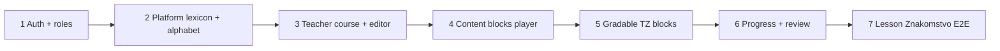

# Even App — MVP

---

## Цель MVP

Ученик записывается на курс по invite-коду, проходит опубликованный урок с новой лексикой и заданиями, получает проверку на сервере, повторяет провалы и копит личный словарь. Учитель собирает урок в редакторе из слов хранилища. Platform administrator наполняет Lexeme repository и алфавит.

**Definition of done:** один реальный урок («Знакомство») можно создать, опубликовать и пройти end-to-end на телефоне и в браузере.

Для MVP ограничимся десктопом

---

## Роли (MVP)

| Участник                                | Что должен уметь                                                                |
| --------------------------------------- | ------------------------------------------------------------------------------- |
| **Student**                             | register/login → join по коду → lesson flow → review → dictionary               |
| **Teacher**                             | register как teacher → курс → редактор урока → publish → invite code → coverage |
| **Platform administrator** (`is_admin`) | lexicon CRUD, alphabet, media upload, назначение `is_admin`                     |

Teacher + `is_admin` — одна сессия, две вкладки (Преподавание + Платформа).

---

## Функциональность

### В MVP

| Область        | Функции                                                                                                                                         |
| -------------- | ----------------------------------------------------------------------------------------------------------------------------------------------- |
| **Auth**       | register (student/teacher), login, refresh, `/auth/me`                                                                                          |
| **Enrollment** | `POST /courses/join` по invite code                                                                                                             |
| **Student**    | список курсов и уроков, lesson flow (1 шаг/экран), проверка gradable, progress, review tab + injection (каждые 3 gradable), personal dictionary |
| **Teacher**    | CRUD курса, CRUD урока (sections + blocks), publish/republish, lexicon picker (read-only), список учеников курса, coverage (lemma + forms)      |
| **Platform**   | languages, lexicon CRUD, alphabet, sounds (базово), **общая media library** (admin пишет, все читают; не сборка с учителей), users (`is_admin`, role) |
| **Teacher media** | **личная library** (только свои; имя, TTL, квота); в урок — своя или общая (read-only picker)                                                    |
| **Общее**      | CustomLanguageKeyboard (эвенский алфавит), S3 медиа, JWT                                                                                        |

### Не в MVP (Phase 2+)

| Функция                                  | Причина                            |
| ---------------------------------------- | ---------------------------------- |
| Офлайн-кэш (SQLite/Drift)                | Только online; проще валидация     |
| Homework, essay, `section_kind=homework` | Ручная проверка учителем           |
| Запись по email / `teacher_students`     | Только invite code                 |
| Lesson lock (`locked_by`)                | Достаточно 409 version conflict    |
| Локализация UI                           | Интерфейс на русском               |
| Оставшиеся **25 BlockType**              | См. таблицу ниже                   |
| Deep link `even.app/join/{code}`         | Достаточно ввода кода в приложении |
| Push-уведомления о review                | In-app due достаточно              |

---

## BlockType — MVP vs Phase 2

### Контент— 6 типов

| block_type       | Назначение                                             | Пример в уроке      |
| ---------------- | ------------------------------------------------------ | ------------------- |
| `vocabulary_set` | Выдача новой лексики (картинка + слово + перевод + 🔊) | «Знакомство. Слова» |
| `images_stacked` | Одна или несколько картинок столбиком                  | Иллюстрации         |
| `audio`          | Аудио (слово / фраза)                                  | Произношение        |
| `text`           | Короткий текст / абзац                                 | Пояснение           |
| `note`           | Заметка редактора (серый блок)                         | Подсказка учителю   |
| `divider`        | Визуальный разделитель                                 | Между секциями      |

### Упражнения (gradable) — 11 типов

Соответствие [Even app.txt](./Even%20app.txt):

| block_type                   | Задание (ТЗ)                                         | gradable |
| ---------------------------- | ---------------------------------------------------- | -------- |
| `prompt_choose_word`         | Картинка/текст/аудиo → выбрать слово на эвенском     | ✓        |
| `prompt_type_word`           | Картинка/текст/аудиo → напечатать слово (клавиатура) | ✓        |
| `word_choose_image`          | Эвенское слово → выбрать картинку                    | ✓        |
| `word_choose_translation`    | Эвенское слово → выбрать перевод                     | ✓        |
| `gap_sentence_choose_word`   | Предложение с пропуском → выбрать слово              | ✓        |
| `prompt_sentence_word_order` | Русское предложение → собрать по словам на эвенском  | ✓        |
| `prompt_sentence_type`       | Русское предложение → напечатать на эвенском         | ✓        |
| `listen_choose_word`         | Послушать слово → выбрать                            | ✓        |
| `listen_type_word`           | Послушать слово → напечатать                         | ✓        |
| `listen_sentence_word_order` | Послушать предложение → порядок слов                 | ✓        |
| `listen_sentence_type`       | Послушать предложение → напечатать                   | ✓        |

**Итого MVP: 17 из 42 BlockType.**

Каждый тип MVP = **editor** + **player** + **validator** (Go `BlockValidatorRegistry`).

### Phase 2 — оставшиеся 25 типов

| Категория                     | block_type                                                                                                     |
| ----------------------------- | -------------------------------------------------------------------------------------------------------------- |
| Изображения                   | `images_carousel`, `gif_animation`                                                                             |
| Аудио/видео                   | `video`, `audio_record`                                                                                        |
| Чтение                        | `reading_yes_no`, `reading_short_answer`                                                                       |
| Грамматика                    | `grammar_table`, `grammar_exercise`                                                                            |
| Слова и пропуски (ProgressMe) | `gap_word_drag`, `gap_word_type`, `gap_word_select`, `image_word_drag`, `image_word_type`, `image_word_select` |
| Тесты                         | `test_untimed`, `test_timed`                                                                                   |
| Выбор                         | `true_false_unknown`                                                                                           |
| Расставить                    | `sentence_word_order`, `words_sort_columns`, `text_reorder`, `word_from_letters`, `word_matching`              |
| Текст                         | `article`, `essay`                                                                                             |
| Прочее                        | `link`                                                                                                         |

---

## Поведение (кратко)

| Правило             | Значение                                            |
| ------------------- | --------------------------------------------------- |
| Lesson flow         | Один item на экран; `GET /lessons/{id}/flow`        |
| Review unit         | `lesson_block_id` + `sub_item_index`                |
| Review injection    | После каждых 3 gradable-блоков, если есть due items |
| Review intervals    | 4ч → 1д → 3д → 7д                                   |
| Personal dictionary | Lexeme после **успешного** gradable                 |
| Republish           | Сброс **всего** прогресса по уроку                  |
| Invite code         | 8 символов A–Z0–9, один на курс, бессрочный         |

---

## Первый контент

| Артеfact          | Описание                                                                                            |
| ----------------- | --------------------------------------------------------------------------------------------------- |
| Язык              | `evn` (эвенский), UI `ru`                                                                           |
| Алфавит           | Буквы эвенского, включая `Ӈ` / `ӈ`                                                                  |
| Lexeme repository | ~20–30 слов урока «Знакомство» (lemma, формы, ru-перевод, image + audio)                            |
| Course            | «Эвенский A1», один owner-teacher                                                                   |
| Lesson            | «Знакомство» по [lesson_example.pdf](./lesson_example.pdf): vocabulary_set → задания из MVP-таблицы |

---

## Экраны (MVP)

| Роль           | Экраны                                                                                                                   |
| -------------- | ------------------------------------------------------------------------------------------------------------------------ |
| Все            | Login, Register, Profile                                                                                                 |
| Student        | Join course (код), Courses, Lessons, Lesson player, Review, Dictionary                                                   |
| Teacher        | My courses, Lesson editor (sections + blocks + catalog **MVP types only**), Invite code, Students list, Lexicon coverage |
| Platform admin | Lexicon repo, Alphabet editor, Users                                                                                     |

В каталоге блоков редактора Phase 2 типы **скрыты** или помечены «скоро», чтобы не ломать enum в БД.

---

## Порядок реализации

1. **Backend scaffold** — migrations, JWT, middleware
2. **Platform** — lexicon, alphabet, S3 presign
3. **Teacher** — course, lesson CRUD, publish, invite code
4. **Player** — content blocks (6)
5. **Player + validators** — gradable blocks (11), keyboard
6. **Progress** — attempts, review queue, injection, dictionary
7. **Content** — наполнить «Знакомство», прогнать E2E

---

## Критерии приёмки

- Student регистрируется, вводит invite code, видит курс
- Student проходит урок «Знакомство» от первого блока до последнего
- Gradable проверяется сервером; при провале item появляется в Review
- После 3 gradable в уроке inject'ится due review (если есть)
- Успешные слова появляются в Personal dictionary
- Teacher создаёт урок, добавляет MVP-блоки через picker, publish
- Republish сбрасывает прогресс ученика по уроку
- Platform admin добавляет lexeme с картинкой и аудио; teacher reuse в блоке
- Клавиатура содержит `Ӈ`, `ӈ`
- Coverage показывает introduced/exercised forms по курсу

---

## Связанные документы

- [APP.md](./APP.md) — архитектура
- [API.md](./API.md) — REST
- [DTO.md](./DTO.md) — полный enum 42 типов
- [CONTEXT.md](./CONTEXT.md) — глоссарий

